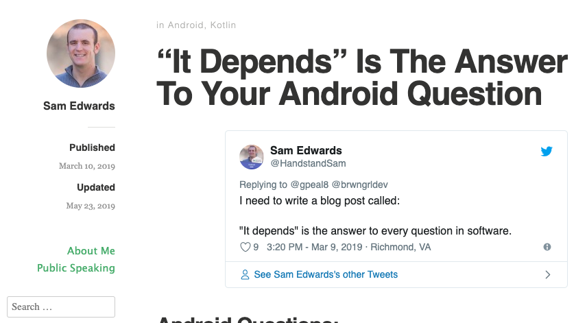
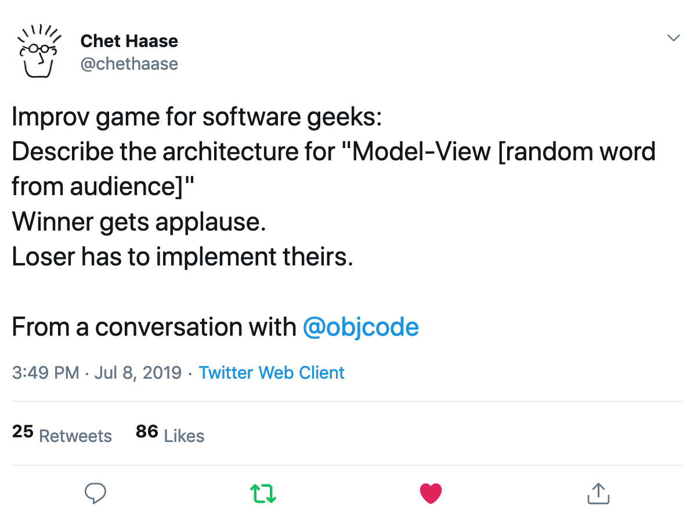

slidenumbers: true
autoscale: true
footer: @AdamMc331<br/>ttv/adammc<br/>#DCSF24
build-lists: true

## MVWTF: Demystifying Architecture Patterns

### Adam McNeilly - @AdamMc331

---

# You May Have Heard These Buzzwords:

* MVC
* MVP
* MVVM
* MVI

[.build-lists: false]

---

# Why Are There So Many?

---

# What's The Difference?

---

# Which One Should I Use?

---

# Which One Should I Use?



---


# Why Do We Need Architecture Patterns?

---

# More Buzzwords!

* Maintainability
* Extensibility
* Robust
* Testable

---

# Let's Start With One Simple Truth

---

# You Can't Put Everything In The Activity

---

# Or Your Fragment[^1]


[^1]: Thanks Mauricio for proofreading

---

# Why Not?

* Not readable
* Difficult to add new code
* Difficult to change existing code
* Can't write Junit tests for this

---

# We Need To Break Up Our Code

---

# Let's Explore Some Options

---

# Model-View-Controller

- One of the earliest architecture patterns
- Introduced in the 1970s as a way to organize code
- Divides application to three parts

---

# Model

- This is your data source
- Database, remote server, etc
- It does not care about the view

---

# View

- This is the visual representation of information
- Does not care where this data came from
- Only responsible for displaying data
- If your view has a conditional, consider refactoring

---

# Controller

- Handles user inputs
- Validates if necessary
- Passes input to model
- Passes model response to view

---

# The Model & View Components Are The Same For All Patterns

---

 

---

# Model-View-WhateverTheFYouWant

---

# Why Do We Have So Many Options For This Third Component? 

---

# Short Answer: State Management

---

# Long Answer: Let's Break Them Down

---

# Model-View-Controller


---

# Why Don't We Use This For Android?

---

# Why Don't We Use This For Android?


---

# Why Don't We Use This For Android?

- We can't write Junit tests for an Activity
 - We can't unit test our UI logic
- We don't really have a separation of concerns here

---

# Model-View-Presenter

---

# Model-View-Presenter

* Similar to the last pattern
* Moves our presentation logic out of the Activity class

---

# Model-View-Presenter


---

# Why Is This Better?

- UI logic is outside of the Activity, and now supports Junit tests
- Our concerns are separated again

---

# MVP Implementation

---

# Contract Class

```kotlin
object TaskListContract {
    interface Model {
        // ...
    }

    interface View {
        // ...
    }

    interface Presenter {
        // ...
    }
}
```

---

# Contract Class

```kotlin
object TaskListContract {
    interface Model {
        suspend fun getTasks(): List<Task>
    }

    // ...
}
```

---

# Contract Class

```kotlin
object TaskListContract {
    interface View {
        fun render(tasks: List<Task>)
    }

    // ...
}
```

---

# Contract Class

```kotlin
object TaskListContract {
    interface Presenter {
        fun viewCreated()

        fun viewDestroyed()
    }

    // ...
}
```

---

# Model

```kotlin
class InMemoryTaskRepository : TaskListContract.Model {
    override suspend fun getTasks(): List<Task> {
        return listOf(
            Task("Test Task 1"),
            Task("Test Task 2"),
            Task("Test Task 3"),
        )
    }
}
```

---

# View

```kotlin
class MainActivity : TaskListContract.View {
    private val presenter = TaskListPresenter(
        view = this,
        model = InMemoryTaskRepository(),
    )

    // ...
}
```

---

# View

```kotlin
class MainActivity {

    override fun onCreate(savedInstanceState: Bundle?) {
        super.onCreate(savedInstanceState)
        
        presenter.viewCreated()
    }

    // ...
}
```

---

# View

```kotlin
class MainActivity {

    override fun render(tasks: List<Task>) {
        setContent {
            TaskList(tasks)
        }
    }

    // ...
}
```

---

# Presenter

```kotlin
class TaskListPresenter(
    private var view: TaskListContract.View?,
    private val model: TaskListContract.Model,
) : TaskListContract.Presenter {

    // ...
}
```

---

# Presenter

```kotlin
class TaskListPresenter {

    private var tasks: List<Task> = emptyList()
        set(value) {
            field = value
            view?.render(value)
        }

    // ...
}
```

---

# Presenter

```kotlin
class TaskListPresenter {

    override fun viewCreated() {
        presenterScope.launch {
            tasks = model.getTasks()
        }
    }

    // ...
}
```

---

# Presenter

```kotlin
class TaskListPresenter {

    override fun viewDestroyed() {
        view = null
    }

    // ...
}
```

---

# State Restoration

---

# State Restoration

```kotlin
object TaskListContract {
    interface Presenter {
        // New:
        fun getTasks(): List<Task>
        fun restoreTasks(tasks: List<Task>)
    }
}
```

---

# Persist State

```kotlin
class MainActivity {

    override fun onSaveInstanceState(outState: Bundle) {
        outState.putParcelableArrayList("tasks", presenter.getTasks())
        super.onSaveInstanceState(outState)
    }

    // ...
}
```

---

# Restore State

```kotlin
class MainActivity {
    override fun onCreate(savedInstanceState: Bundle?) {
        super.onCreate(savedInstanceState)

        val tasks = savedInstanceState?.getParcelableArrayList("tasks")

        if (tasks != null) {
            presenter.restoreTasks(tasks)
        }
    }

    // ...
}
```

---

# MVP Recap

- View does nothing but display data
- Data fetching is all handled by model
- Presentation of data is handled by presenter
- Everything is separated, everything is testable
- State can be fetched/restored as necessary

---

# What's Different About MVVM? 

---

# The Presenter Doesn't Need To Care About The View

---

# Model-View-ViewModel


---

# MVVM Implementation

---

# Model Doesn't Change (much)

```kotlin
interface TaskRepository {
    fun getTasks(): List<Task>
}

class InMemoryTaskService : TaskRepository {

    override fun getTasks(): List<Task> {
        return listOf(...)
    }
}
```

---

# ViewModel

```kotlin
class TaskListViewModel(
    taskRepository: TaskRepository,
) {
    private val mutableTasks = MutableStateFlow(emptyList<Task>())
    val tasks = mutableTasks.asStateFlow()

    // ...
}
```

---

# ViewModel

```kotlin
class TaskListViewModel {

    init {
        viewModelScope.launch {
            tasks.value = taskRepository.getTasks()
        }
    }

    // ...
}
```

---

# View

```kotlin
class MainActivity {

    override fun onCreate(savedInstanceState: Bundle?) {
        super.onCreate(savedInstanceState)

        setContent {
            val tasks by viewModel.tasks.collectAsState()

            TaskList(tasks)
        }
    }

    // ...
}
```

---

# This Is Pretty Close To MVP, With One New Benefit

---

# Since ViewModel Doesn't Reference View, We Can Leverage Android Architecture Component ViewModel To Outlast Config Changes

---

# State Restoration In MVVM

1. Have ViewModel class extend the AndroidX ViewModel class
2. Update Activity to use ViewModelProviders
3. Since Android's ViewModel outlasts config changes, no need to save/restore state, just re-subscribe

---

# State Restoration In MVVM

```kotlin
class TaskListViewModel(
        private val repository: TaskRepository
) : ViewModel() {
    // ...
}
```

---

# State Restoration In MVVM

```kotlin
class MainActivity {
    private val viewModel: TaskListViewModel by viewModels {
        // ...
    }

    override fun onCreate(savedInstanceState: Bundle?) {
        super.onCreate(savedInstanceState)

        setContent {
            val tasks by viewModel.tasks.collectAsState()

            TaskList(tasks)
        }
    }
}
```

---

# MVVM Recap

- All the benefits of MVP
- Decoupled view and presentation layer
- Easier support for configuration changes

---

# Where Does MVVM Fall Short?

---

# Let's Consider A More Complicated State

---

# Let's Consider A More Complicated State

```kotlin
sealed interface TaskListState {
    object Loading : TaskListState
    data class Loaded(val tasks: List<Task>) : TaskListState
    data class Error(val message: String) : TaskListState
}
```

---

# Let's Consider A More Complicated State

```kotlin
class TaskListViewModel(private val repository: TaskRepository) : ViewModel() {
    // ...

    private fun showLoading() {
        state.value = TaskListState.Loading
    }

    private fun fetchTasks() {
        val tasks = repository.getItems()
        state.value = TaskListState.Loaded(tasks)
    }

    private fun showError() {
        state.value = TaskListState.Error("Unable to fetch tasks.")
    }
}
```

---

# What Are The Risks Of These Methods?

```kotlin
private fun showLoading() {
    state.value = TaskListState.Loading
}

private fun fetchTasks() {
    val tasks = repository.getItems()
    state.value = TaskListState.Loaded(tasks)
}

private fun showError() {
    state.value = TaskListState.Error("Unable to fetch tasks.")
}
```

---

# What Are The Risks Of These Methods?

- Any methods in the class can call them
- We can't guarantee they're associated with a specific action or intent
- We have multiple methods manipulating our state that we have to ensure don't conflict with each other

---

# How Can We Mitigate This Risk?

- Have one single source of truth for our state
- Do this through a single pipeline where every action causes a specific change in the state
- This makes state changes predictable, and therefore highly testable as well

---

# Model-View-Intent

---

# Model-View-Intent

- Unlike the previous patterns, "Intent" isn't used to reference a specific kind of component, but rather the _intention_ of doing something that we want to capture in our state.

---

# The First Goal Is To Make Our State Changes Predictable

--- 

# We Can Achieve This With A State Machine

[.code-highlight: 1-4]
[.code-highlight: 5-6]
[.code-highlight: 8-13]
```kotlin
class StateMachine(
    initialState: State,
    private val eventProcessor: (State, StateUpdateEvent) -> State,
) {
    private val mutableState = MutableStateFlow(initialState)
    val state = mutableState.asStateFlow()

    fun processEvent(event: StateUpdateEvent) {
        mutableState.update { currentState ->
            val newState = eventProcessor(currentState, event)
            newState
        }
    }
}
```

---

# Clearly Defined Inputs

```kotlin
sealed class TaskListStateUpdateEvent : StateUpdateEvent {
    data object SetLoading : TaskListStateUpdateEvent()

    data class SetTasks(val tasks: List<Task>) : TaskListStateUpdateEvent()

    data class SetError(val error: String) : TaskListStateUpdateEvent()
}
```

---

# Clearly Defined Outputs

[.code-highlight: 1-2]
[.code-highlight: 3-17]
```kotlin
private val stateMachine = StateMachine<TaskListViewState, TaskListStateUpdateEvent>(
    initialState = TaskListViewState.Loading,
    eventProcessor = { currentState, event ->
        when (event) {
            is TaskListStateUpdateEvent.SetError -> {
                TaskListViewState.Error(event.error)
            }

            TaskListStateUpdateEvent.SetLoading -> {
                TaskListViewState.Loading
            }

            is TaskListStateUpdateEvent.SetTasks -> {
                TaskListViewState.Loaded(event.tasks)
            }
        }
    },
)
```

---

# This State Machine Is Our Source Of Truth

```kotlin
class TaskListViewModel {
    private val stateMachine = // ...

    val state = stateMachine.state
}
```

---

# Side Effects

---

# Side Effects

```kotlin
class StateMachine(
    // ...
    private val eventProcessor: (State, StateUpdateEvent) -> StateAndSideEffects,
    private val sideEffectProcessor: (SideEffect) -> Unit,
)

data class StateAndSideEffects(
    val state: State,
    val sideEffects: List<SideEffect>,
)
```

---

# Task List Flow In MVI

---

# ViewModel Initialization

```kotlin
class TaskListViewModel {

    init {
        stateMachine.processEvent(TaskListStateUpdateEvent.SetLoading)
    }
}
```

---

# Process Loading Event

```kotlin
private val stateMachine = StateMachine(
    eventProcessor = { currentState, event ->
         when (event) {
            TaskListStateUpdateEvent.SetLoading -> {
                TaskListViewState.Loading + TaskListSideEffect.FetchTasks
            }

            // ...
        }
    },
)
```

---

# Process Side Effect

```kotlin
private val stateMachine = StateMachine(
    // ...
    sideEffectProcessor = { sideEffect ->
        when (sideEffect) {
            TaskListSideEffect.FetchTasks -> {
                fetchTasks()
            }
        }
    },
)
```

---

# Process Side Effect

```kotlin
private fun fetchTasks() {
    viewModelScope.launch {
        val event = try {
            val tasks = taskRepository.getTasks()

            TaskListStateUpdateEvent.SetTasks(tasks)
        } catch (e: Exception) {
            TaskListStateUpdateEvent.SetError(e.message)
        }

        stateMachine.processEvent(event)
    }
}
```

---

# Process Resulting Events

```kotlin
private val stateMachine = StateMachine(
    eventProcessor = { currentState, event ->
         when (event) {
            is TaskListStateUpdateEvent.SetError -> {
                TaskListViewState.Error(event.error).noSideEffects()
            }

            is TaskListStateUpdateEvent.SetTasks -> {
                TaskListViewState.Loaded(event.tasks).noSideEffects()
            }

            // ...
        }
    }
)
```

---

# MVI Recap

- All benefits of previous patterns
- State management is clear and predictable

---

# Is MVI The Best We Can Do?

- State management is pretty solid
- But, we have 22 letters that weren't covered yet

---

# What Should I Take Away From This?

---

# Model-View-Presenter

- Seperated concerns and testing support
- Okay for quick prototyping
- Managing state across config changes requires work
- State management is unpredictable

---

# Model-View-ViewModel

- Seperated concerns and testing support
- Even better for quick prototyping
- Can handle config changes easily if we use Android's architecture components
- State management is unpredictable

---

# Model-View-Intent

- Seperated concerns and testing support
- Works with both a Presenter and a ViewModel
- Not good for quick prototyping
- State management is clear and predictable
- Has a steeper learning curve due to state machine logic

---

# General Suggestions

- MVP can get you up and running quickly, but due to the boilerplate and config changes work I wouldn't recommend it
- MVVM is what I'd recommend the most. It allows for separation of concerns and unit test support without a major learning curve
- If your app handles complex user flows or states, MVI can give you more support for state management

---

# What's Most Important

- Be consistent
- Be comfortable

---

## Thank you! 

### https://github.com/adammc331/mvwtf2024


